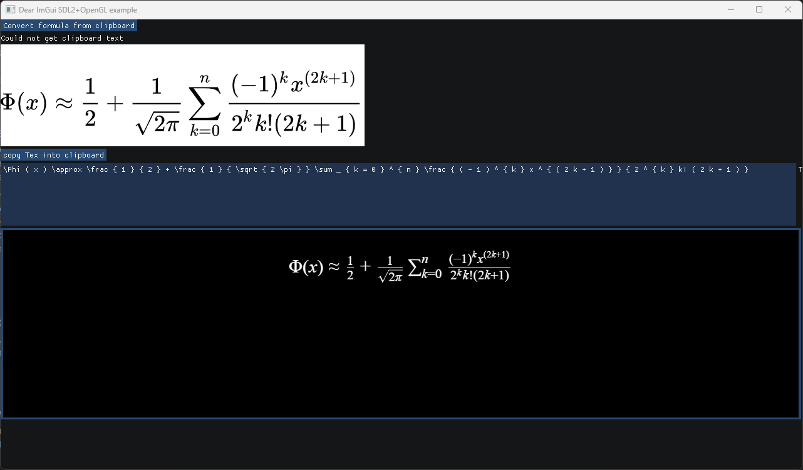

# ImMathWriter

A desktop application which takes an image of math formula and return corresponding LaTeX code.

This project used the following open source projects:

- Mathematical Formula Recognition Model (MFR): [breezedeus/pix2text-mfr](https://huggingface.co/breezedeus/pix2text-mfr) (For formula recognition)
- Imgui: [ocornut/imgui](https://github.com/ocornut/imgui) (For GUI)
- chromium embedded framework: [chromiumembedded/cef](https://github.com/chromiumembedded/cef) (For rendering math formula in html)
- Katex: [Khan/KaTeX](https://github.com/Khan/KaTeX) (For rendering math formula)
- zeromq: [zeromq/libzmq](https://github.com/zeromq/libzmq) (For inter-process communication)

## The usage

1. Download the release version from [Releases]()
2. Run the executable file
3. Capture an image of the math formula into clipboard (shift + win + S on windows platform)
4. Click the "Convert formula from clipboard" button and wait for the result
5. Copy the Tex result to the clipboard.

## The screenshot

## Development Notes

This application is really quick dirty hack based on [hendradarwin/imgui](https://github.com/hendradarwin/imgui) cef-support branch. It's not a well-structured project.

build step:

1. Clone the project
2. install python dependencies: follow the instructions from [hugging face](https://huggingface.co/docs/transformers/quicktour)
3. `pip install pyinstaller`
4. step into example_sdl_opengl2 folder, run `python export_onnx.py` to save the onnx model in local folder
5. run `pyinstaller texocr_pix2tex.spec` to package up the python script and onnx model
6. download `cef_binary_3.3578.1860.g36610bd` version cef prebuild archive from [Chromium Embedded Framework (CEF) Automated Builds](https://cef-builds.spotifycdn.com/index.html), and unzip it into `thirdparty/cef`
7. use cmake build the project with vcpkg
8. copy the packaged texocr_pix2tex program into target build folder

## License

This project is licensed under the MIT License - see the [LICENSE.txt](LICENSE.txt) file for details.
